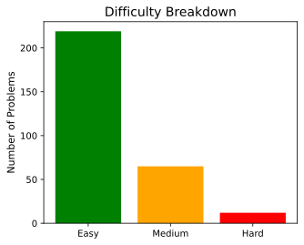
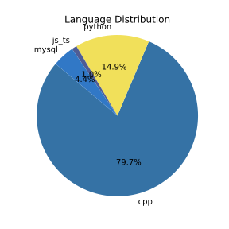

# My Daily Grind

> A log of all the algorithmic problems I have solved in Python, C++, SQL etc. on Leetcode. Built to demonstrate my deep understanding of core CS concepts through real-world coding drills, optimizations, and pattern-based thinking.

## Overview

This repository documents my structured problem-solving journey across a wide range of topics including Dynamic Programming, DSA and Algorithms. Each solution is sometimes accompanied by optimizations and alternative approaches, emphasizing patterns and strategies.

## Stats Summary

<!-- STATS:START -->
- **Total Problems Solved**: 296
- **Languages Used**: cpp (236), python (44), js_ts (3), mysql (13)
- **Difficulty Breakdown**:
- Easy: 219
- Medium: 65
- Hard: 12
<!-- STATS:END -->

## Language Distribution

  
  

## Folder Structure

<pre>
the-daily-grind/
│
├── leetcode/
│   ├── python/
│   │   ├── 01_easy/
│   │   ├── 02_medium/
│   │   └── 03_hard/
│   ├── cpp/
│   │   ├── 01_easy/
│   │   ├── 02_medium/
│   │   └── 03_hard/
│   ├── . . .
│   .
├── hackerrank/
│   ├── problem_solving/
│   │   ├── 01_easy/
│   │   ├── 02_medium/
│   │   └── 03_hard/
│   .
│   .
├── assets/              # for charts and visuals
└── misc/             # for automation and stat generation
</pre>

---

## 📜 License

MIT License © [Nikhil Singla](https://github.com/Nikhil-Singla)
