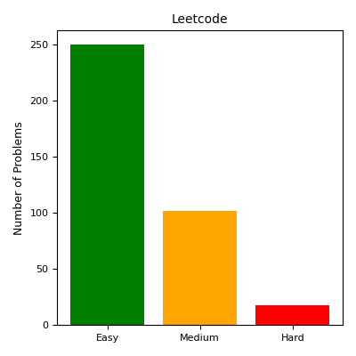
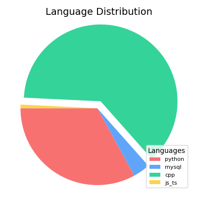

# My Daily Grind

> A log of algorithmic problems solved in Python, C++, SQL, JavaScript, and more—across Leetcode and HackerRank. Built to demonstrate deep understanding of core CS concepts through structured coding drills, pattern recognition, and solution design.

---

## Overview

This repository documents my problem-solving journey across data structures, algorithms, and systems-style challenges. Solutions emphasize clarity, performance, and repeatable reasoning strategies, often including multiple variations and optimizations.

---

## Stats Summary

<!-- STATS:START -->
- **Total Problems Solved**: 316
- **Languages Used**: cpp (247), python (53), js_ts (3), mysql (13)
- **Difficulty Breakdown (Leetcode Only)**:
- Easy: 219
- Medium: 65
- Hard: 12
<!-- STATS:END -->

---

## Distribution Visualization

  
  

---

## Folder Structure

<pre>
the-daily-grind/
│
├── leetcode/
│   ├── python/
│   │   ├── 01_easy/
│   │   ├── 02_medium/
│   │   └── 03_hard/
│   ├── cpp/
│   │   ├── 01_easy/
│   │   ├── 02_medium/
│   │   └── 03_hard/
│   ├── ...
│
├── hacker_rank/
│   ├── problem_solving/
│   ├── python/
│   └── ...
│
├── assets/              # for charts and visuals
└── misc/                # for stat generation and automation scripts
</pre>

---

## License

MIT License © [Nikhil Singla](https://github.com/Nikhil-Singla)
